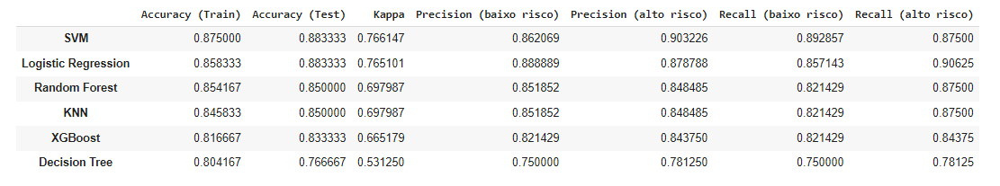

# Análise e Predição de risco de Ataque Cardíaco

#### Aluno: [Moisés Ferreira de Souza](https://github.com/moisesfsouza)
#### Orientadora: [Manoela Kohler](https://github.com/manoelakohler)

---

Trabalho apresentado ao curso [BI MASTER](https://ica.puc-rio.ai/bi-master) como pré-requisito para conclusão de curso e obtenção de crédito na disciplina "Projetos de Sistemas Inteligentes de Apoio à Decisão".

- [Link para o código](predicao_risco_ataque_cardiaco.ipynb).

---

### Resumo

Um ataque cardíaco ocorre quando uma artéria que fornece sangue e oxigênio ao coração fica bloqueada. Os depósitos de gordura se acumulam com o tempo, formando placas nas artérias do coração. Se uma placa se romper, um coágulo de sangue pode se formar e bloquear suas artérias, causando um ataque cardíaco.

O objetivo deste trabalho é criar um classificador para predizer se um paciente tem baixo ou alto risco de ataque cardíaco com base em informações clínicas.

O dataset utilizado neste trabalho é público e disponível no [Kaggle](https://www.kaggle.com/rashikrahmanpritom/heart-attack-analysis-prediction-dataset) com informações clinicas de pacientes e o respectivo diagnóstico médico de baixo ou alto risco de ataque cardíaco.

A metodologia utilizada consiste em realizar uma análise exploratória dos dados, tratamento dos dados, experimentação de diversos modelos de classificação e análise dos resultados e hiperparâmetros.

### 1. Introdução

Um enfarte agudo do miocárdio ou infarto agudo do miocárdio, vulgarmente denominado ataque cardíaco, ocorre quando a circulação de sangue para uma parte do coração é interrompida, causando lesões no músculo cardíaco.

Antes do infarto ocorrer vários sintomas e informações clínicas indicam se o paciente está com baixo ou alto risco. Este trabalho, tem por objetivo realizar uma análise exploratória e um classificador com base em um conjunto de informações dos pacientes utilizando um dataset disponível no [kaggle](https://www.kaggle.com/rashikrahmanpritom/heart-attack-analysis-prediction-dataset).

A primeira parte do trabalho consiste em realizar análise exploratória e tratamento dos dados como tratamento de missing values, aplicação de normalização, redução de dimensionalidade e seleção de atributos. Também será verificado se há necessidade de aplicar balanceamento nos dados e remoção de outliers.

A segunda parte do trabalho consiste na modelagem e uso de diversos modelos de aprendizagem supervisionada. Nesta etapa será realizado uma busca e tuning dos melhores hiperparâmetros de cada modelo que melhor se adequa ao problema.

Este trabalho utiliza a linguagem python e como principais bibliotecas o scikit-learn para modelagem e seaborn para visualização dos dados.

 

**Descição dos atributos o dataset:**

**age**: Idade do paciente

**sex**: sexo do paciente

**cp**: tipo de dor torácica, 0 = angina típica, 1 = angina atípica, 2 = dor não anginosa, 3 = assintomática

**trtbps**: pressão arterial em repouso (em mm Hg)

**chol**: colesterol em mg / dl obtido por meio do sensor de IMC

**fbs**: (açúcar no sangue em jejum> 120 mg / dl), 1 = Verdadeiro, 0 = Falso

**restecg**: Resultados eletrocardiográficos em repouso, 0 = normal, 1 = normalidade da onda ST-T, 2 = hipertrofia ventricular esquerda

**thalachh**: frequência cardíaca máxima alcançada

**oldpeak**: pico anterior

**slp**: declive

**caa**: Número de vasos principais

**thall**: resultado do teste de estresse com tálio ~ (0,3)

**exng**: Angina induzida por exercício ~ 1 = Sim, 0 = Não

**output**: classificação (0- baixo, 1 - alto)

### 2. Modelagem

Após análise exploratória dos dados foi possível chegar às seguintes conclusões:

* Não há missing values no dataset.
* Variáveis **chol**, **trtbps**,  **fbs** e **restecg** têm baixa correlação e significância estatística com a prossibilidade de ataque cardíaco e não farão parte do modelo. 
* Outliers das variáveis **thalachh** e **oldpeak** foram removidos.
* Não há relação linear entre as variáveis númericas selecionadas.
* Como de se esperar, pessoas mais velhas possuem mais risco de ataque cardíaco.
* Pessoas com maior frequência cardiaca (**thalachh**) têm mais risco.
* Pessoas com menor **oldpeak** têm mais risco.  
* Pessoas com dores **cp** = 2 têm maior chance de ataque cardíaco.
* Pessoas com **caa** = 0 têm maior chance de ataque cardíaco.
* Pessoas com **sex** = 1 (provavelmente homens) têm maior chance de ataque cardíaco.
* Pessoas com **enxg** = 0 têm maior chance de ataque cardíaco.
* Pessoas com **thall** = 2 têm maior chance de ataque cardíaco.

O seguintes modelos de classificação foram testados:
- **Decision Tree**
- **XGBoost**
- **KNN**
- **Random Forest**
- **SVM**
- **Logistic Regression**

Para realizar o pré-processamento dos dados tanto de treino quanto de teste foi utilizado uma abordagem de **pipeline** do python de processamento e transformação dos dados.  

Apesar de não haver missing values, o pipeline foi configurado para no caso de missing values de dados categóricos substituir pela **moda** enquanto que para as características numéricas a **mediana**.

Os atributos categóricas foram codificados em números através da técnica **one hot encoding**, removendo uma das colunas para eliminar a **multicolinearidade** dos dados.

Apesar da análise e redução de variáveis realizada anteriormente, para todos os modelos uma nova redução de dimensão foi aplicada ao pipeline de modo a extrair as variáveis relevantes para cada modelo. Para os modelos de **Decision Tree** e **XGBoost** será aplicado uma redução baseada no teste **anova** para dados numéricos e **chi square** para dados categóricos. Para **KNN**, **SVM** e **Logistic Regression** o **PCA** e para **Random Forest** nenhuma redução de dimensionalidade será aplicada.

Para os modelos que são mais sensíveis a grandeza dos atributos ou que utilizaram PCA para redução da dimensionalidade foi aplicado a normalização dos dados: KNN, SVM e Logistic Regression. A padronização Z score foi a que trouxe melhores resultados.

Uma busca exaustiva, utilizando o **GridSearchCV**, foi utilizada para melhor escolher o tamanho da redução da dimensionalidade e os **hiperparâmetros** dos modelos.

Por fim, foi utilizado **cross validation** com 3 folds (**k-fold**).

### 3. Resultados

Os modelos com melhor resultado foram o **SVM** e **Logistic Regression** com acurácia de 88% e kappa de 76%.

A tabela abaixo apresenta a acurácia para o conjunto de treino e teste, além do kappa e da precisão e recall de cada classe.

Para o **SVM**, o melhor resultado utilizou 12 componentes principais com seguintes hiperparâmetros após o tuning:

c: 4

gamma: 0.1

kernel: rfb

 

Já para o **Logistic Regression**, o melhor resultado utilizou, também, 12 componentes principais com seguintes hiperparâmetros após o tuning:

c: 2.78

penalty: 12

iterações: 300

solver: newton-cg

### 4. Conclusões

O classificador conseguiu 88% de acurácia emmdois modelos distintos (**SVM** e **Logistic Regression**). Este resultado pode ser atribuído a alguns fatores:
- Diminuição de dimensionalidade através de análise exploratória e métodos estatísticos como **ANOVA**, **Chi Square** e pelo **PCA**.
- Normalização dos dados para os modelos mais sensíveis a grandeza das variáveis ou que utilizaram PCA para redução da dimensionalidade: KNN, SVM e Logistic Regression. A padronização Z score foi a que trouxe melhores resultados.
- Busca exaustiva dos hiperparâmetros mais adequados para cada algoritmo e dos dados.

A escolha dos itens acima foi um processo iterativo de acertos e erros das técnicas empregadas.

---

Matrícula: 192.671.115

Pontifícia Universidade Católica do Rio de Janeiro

Curso de Pós Graduação *Business Intelligence Master*
